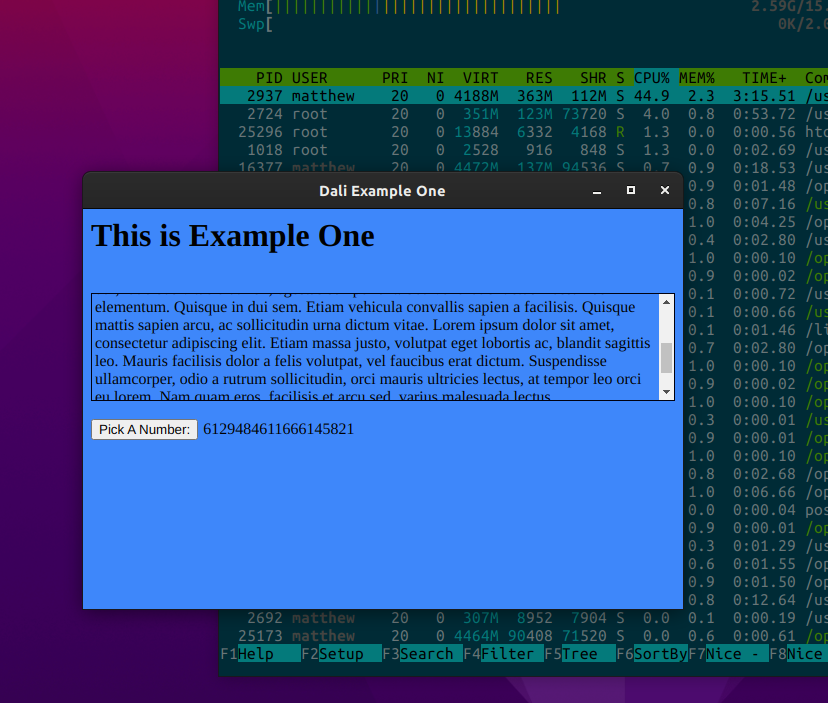
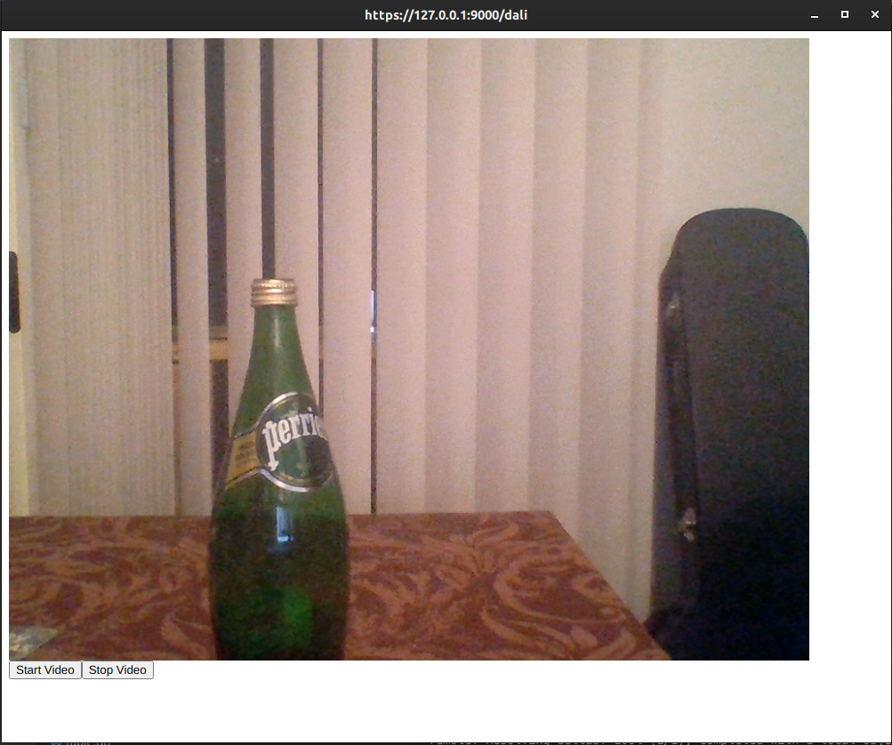

# Dali #  


## Summary ##  
Dali is a pure Golang library built on [lorca](http://github.com/zserge/lorca) in order to provide Go developers a way to create GUI-based applications using idiomatic Go.

Lorca provides a minimal binding between Go and Chrome via the Chrome Developer API.  The output of Dali is a Chrome application.  

The goal is remove the need for Go developers to embed HTML or Javascript within their applications.  Dali produces the HTML, passes it to Lorca, which serves up the application.

## What Need Does Dali Fulfill? ##  
I am a fan of data science and infographics.  I see a huge potential for Golang to supplant R, Python and C++ as solutions for data scientists, but it lacks the out-of-the box tools that Python and R have accumulated over time.

Go is much more readable than R and C++.  It is much more peformant than Python.  It supports code paralellization and includes built-in garbage collection - two challenges that data science applications can suffer from.

My hope is that Dali will help reduce the learning curve for Go, and pave the way to making Go teachable and usable within the context of interdisceplnary data sciance classrooms and laboratories.

## What is In A Name? ##
Dali, well known as a surrealist artist, was intimate friends with the poet, Lorca.  The [lorca](http://github.com/zserge/lorca) project explains its name, but you can learn more about the men [here](https://art-sheep.com/federico-garcia-lorca-and-salvador-dali-a-pure-friendship-or-a-great-romantic-affair/).

## License ##
The Dali project is licensed under the [MIT Licesnse](http://github.com/matthewapeters/dali/LICENSE)

## Examples ##

The examples are in the `examples` directory.   Read through the code, run them, change them!

1. `cd examples/one`
1. `go run example_one.go`


A simplified example that shows the nature of building a UI, giving it components, and launching it:  
```go
package main

import (
	"github.com/matthewapeters/dali"
)


func main() {
	/**
	 * Example one shows the creation of a window with a title.
	 */
	Window := dali.NewWindow(600, 400, "", "")
	Title := &dali.TitleElement{Text: "Dali Example One"}
	Head := dali.NewHeadElement()
	Head.Elements.AddElement(Title)
	Window.Elements.AddElement(Head)

	/*Add a body with no on-load function, and a blue background*/
	Body := dali.NewBodyElement("")
	Body.SetStyle( "background:#5080FF;")

	/*Add an H1 banner named pageBanner to the GUI*/
	Banner := dali.NewHeader(dali.H1, "pageBanner", "This is Example One")
 
    /*Add the banner to body, and add the body to the window*/
    Body.Elements.AddElement(Banner)
	Window.Elements.AddElement(Body)

	/*Start the GUI*/
	Window.Start()

	/*Wait for the GUI to close*/
	<-Window.GetUI().Done()
	fmt.Println("The GUI has closed."))
```
### Example One ###  

__Example One illustrates the ease of creating a desktop app with Dali.  The Pick A Number function is written in Go, then displayed on the window.  Project objective is to eliminate library users' need to write JavaScript._


### Exaple Two ### 


_Example Two streams images of randomly sized, colored, and positioned dots.  The multiple example_two processes show these are being produced asynchronoushly and in parallel_


### Example Three ###  
With collaborative help from Christopher R Peters on use of HSV coloring, viewport panning and coding and testing.


_Example Three will help you discover the Mandelbrot set. The automated "Start Iteration" uses an increasingly higher-resolution fractal drawing through increased iteration. Each pixel is iterated over n times from 0 to 5000.  The "Pause Iterations"/"Resume Iterations" button allows you to stop and change your focal point on the Imaginary Number Place.  For performance, chunks of the image are processed in their own go routine.  Chunks quantities are based on the number of CPUs available and the number of iterations requested.  Each of the variables is also directly editable, and buttons provide point-and-click exploration of the Mandelbrot set.  You can save your favorite views and come back to them later.  A number of palettes are provided to delight the user in their exploration._

Example Three is more complex to build than the first two examples:

```go
$ cd examples/three
# This step is necessary because I am not committing Dali and Lorca recursively in the examples!  See .gitignore for details
$ go mod vendor
$ go build .
$ ./examples_three
```
The objective for this example was to identify highly used Javascripting in order to improve the Dali feature set, and to produce an application which exercised the power of Golang's concurrency and speed.

### Example Four ###  
Adding Media Stream access with a Video Element

  
<img alt="Permit Audio and Video" src="./docs/four_two.png" style="width:180px;height:140px;")  
Using StartTLS to launch the window, we can enguage the camera and microphone, and display video streams.  


Would like to try with [pion/webrtc](https://github.com/pion/webrtc) sometime in the future.


# Contributing to Dali #  

I am happy to incorporate contributions and improvements.  As a rule, I am hoping to accomplish the following with this project:

1. Make a library that allows for idiomatic Golang GUI creation
1. Provide for all of the styling and interactability that HTML5 allows for
1. For the library user:  
   1. Minimize magic and secrets 
   1. Minimize necessary JavaScript
   1. Minimize necessary HTML
1. Quickly spin up distributable graphical applications that allow developers to leverage the power of Go
1. Allow the stength of diverse teams to make applications better:
   1. Support the incorporation of sophisticated stylesheets
   1. Support the incorporation of sophisticated javascript behaviors 
   1. Support the separation of layers: do not require the embedding of scripts and stylesheets

Things that are out-of-scope and that `dali` is not concerned with
1. Creating websites 
1. Creating webservers
1. Creating enterprise-scale applications / concurrent user sessions


## Funding and Supporting Dali ##
Dali is not my full-time effort.  My employer is not funding my Dali efforts, and I do not want to compromise either their or my intellectual properties.  If you find Dali useful or full of potential for your efforts, I am accepting patronage support at [Patreon](https://www.patreon.com/matthewapeters)